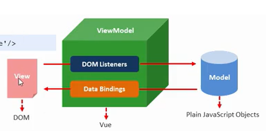

[TOC]

# Vue

## Vue概述

渐进式JavaScript框架

声明式渲染=>组件系统=>客户端路由=>集中式状态管理=>项目构建

helloworld！

```js
  <body>
    <div class="app">
      {{msg}}         // 插值表达式
    </div>
  </body>
  <script type="text/javascript">
    var vm = new Vue({
      el: ".app",    // el 元素的挂载位置(CSS选择器 || DOM元素)
      data: {        // data 模型数据(数据是一个对象)
        msg: "hello world!",
      },
    });
  </script>
```


## Vue模板语法

1. **指令** （v-cloak 页面刷新，隐藏画面*{{msg}}*元素 => 插值表达式闪动问题）

   ```css
   [v-cloak] {
     display: none;
   }
   ```

   自定义属性以**v-指令**

   v-text v-html(不荐用户提交时使用) v-pre

   **数据响应式** 

   数据驱动画面变化、数据绑定

   v-once 只编译一次，不具备数据响应。

   

2. **双向数据绑定 v-model** 

   **MVVM设计思想** model - view - (View-Model)

   视图-模型 （DOM监听） 模型-视图（事件绑定）

   v-on   v-bind 可实现双向数据绑定。

   `v-on:input='msg=$event.target.value'`



3. **事件绑定**

   `v-on:click`   `@click`

4. 事件修饰符

   阻止冒泡 ：

   - 标签内 ：`@click.stop='fun()'` 

   - 方法内 ： `event.stopPropagation();`

   阻止默认行为

   - 标签内 ：`@click.prevent='fun()'` 

   - 方法内 ： `event.preventDefault();`

5. **按键修饰符**

   - 标签内 ：`@click.keyup.enter='fun()'` 

6. **自定义按键修饰符**

   `Vue.config.keyCodes.aaa = 65`
   
7. 属性绑定

   - 标签内 ：`<a v-bind:href='url'></a>`

   - 简写    ：`<a :href='url'></a>`

8. **样式绑定**

   - class样式处理

     默认class保留

     - 对象语法：`<div v-bind:class='{active:isActive}'></div>`

     - 数组语法：`<div v-bind:class='[activeClass, errorClass]'></div>`

   - style样式处理

     - 对象语法：`<div v-bind:style='{color:isActiveColor, fontSize:isActiveFontSize}'></div>`

     - 数组语法：`<div v-bind:class='[colorStyle, fontSizeStyle]'></div>`

9. **分支循环标签**

   v-if、v-else、v-else-if **控制元素是否渲染到页面**

   v-show:渲染页面、控制其是否显示`style：{dispaly:none}`

   v-for遍历数组 `<li v-for='(item,index) in list'>{{item}}</li>`

   - key：帮助Vue区分不同元素提高性能

     `<li :key='itme.id' v-for='(item, index) in list'>{{item}}</li>`

## Vue常用特性

1. **表单操作**

   - 单选 =>多选**multiple**

   - 表单域修饰符

     `v-model.number='age'`

     `v-text.trim=' 12 2 '`

     **lazy** input事件转change事件

     `v-model.lazy='text'` 

     **input事件**：输入内容一旦发生变化，立即触发事件。

     **change事件**：当表单失去鼠标焦点时，触发事件。

2. **自定义指令**

   ```js
   // 以下内容声明在new Vue()之前
   // v-focus 
      Vue.directive("focus", {
         // 当被绑定的元素插入到 DOM 中时……
         inserted: function (el) {
           // 聚焦元素
           el.focus();
         },
   ```

   ```js
   // 带参数指令
   // v-color='{color:"orange"}' 
   
     Vue.directive("color", {
         // 当被绑定的元素插入到 DOM 中时……
         bind: function (el, binding) {
           el.style.backgroundColor = binding.value.color;
         },
       });
   ```

   

3. **计算属性 computed**

   计算属性：基于依赖（即v-model数据的变化）产生缓存

   方法：不产生缓存，每次都会执行。

4. **过滤器 filter**

   作用：格式化数据 upper/lower/日期格式化等

   标签内：`<div>{{msg | upper | lower}}</div>`

   `<div v-bind:id="id | upper | lower"></div>`

5. **侦听器 watch**

   场景：当数据变化执行异步或开销较大的操作

   注意：watch内方法名要与**监听对象**一致。

   ```js
        filters: {
           foramt: function (date, format) {
             var ret = "";
             ret += date.getFullYear() + "_" + (date.getMonth() + 1);
             return ret;  // 过滤器要有返回值
           },
         },
   ```

6. **生命周期**

   挂载、更新、销毁

   1. **beforeCreate** 实例初始化后，数据观测和（event/watcher ）事件配置之前被调用
   2. **created** 实例创建完成后被调用
   3. **beforeMount** 在挂载之前被调用
   4. **mounted** el被新创建的`vm.$el`替换、并挂载到实力上后调用该钩子
   5. **beforeUpdate** 数据更新时调用、发生在虚拟DOM打出补丁之前
   6. **updated** 由于数据更改导致虚拟DOM重新渲染画面/打补丁、之后调用该钩子
   7. **beforeDestroy** 实例销毁之前调用
   8. **destroyed** 实例销毁后调用

   总结：

   beforecreated：el 和 data 并未初始化
   created:完成了 data 数据的初始化，el没有，画面**{{message}}**，这是 Virtual DOM（虚拟Dom）技术，先把坑占了。到mounted挂载、再将值渲染进去。
   beforeMount：完成了 el 和 data 初始化
   mounted ：完成挂载

7. **数组相关API**

   **响应式变化**修改相应是数据

   `Vue.set(vm.items, indexOfItem, newValue)`

   `vm.$set(vm.items, indexOfItem, newValue)`

   数组更新检测

   ```swift
   push() 接收任意数量的参数，把它们逐个添加到数组末尾，并返回修改后数组的长度
   pop() 从数组末尾移除最后一项，减少数组的length值，然后返回移除的项
   shift() 移除数组中的第一个项并返回该项，同时数组的长度减1
   unshift() 在数组前端添加任意个项并返回新数组长度
   splice() 删除原数组的一部分成员，并可以在被删除的位置添加入新的数组成员
   sort() 调用每个数组项的toString()方法，然后比较得到的字符串排序，返回经过排序之后的数组
   reverse() 用于反转数组的顺序，返回经过排序之后的数组
   ```

   替换数组

   `filter()`、`concat()` 和 `slice()`它们不会变更原始数组，而**总是返回一个新数组**。

   由于 JavaScript 的限制，Vue **不能检测**数组和对象的变化

## Vue组件化开发

1. **全局组件注册**

```js
// 组件注册
Vue.component("btn-count", {
  // data是函数，保证组件内部数据相互独立
  data: function () {
    return {
      count: 0,
    };
  },
  // 必须具备单个根元素，支持ES6模板字符串
  template: `
  <div>
      <button @click="handle" v-text='count'></button>
      </div>
  `,
  methods: {
    // 方法调用
    handle: function () {
      this.count += 2;
    },
  },
});
```

2. **命名规则**

   驼峰式命名组件、全局作用域下转分隔符-连接、在ES6模板字符串中直接使用.

3. **局部组件注册**

   局部组件只能在父组件#app的标签下使用

4. Vue调试工具

5. 组件间交互

   props **单向数据流**

   命名规则：
   
   props：[驼峰式] 
   
   ES6模板字符串：[驼峰式]
   
   html标签中：分隔符链接
   
   传递参数类型：
   
   string
   
   number `:pnum="12"` 返回num    `pnum="12"`返回 string
   
   boolean 同上
   
   - 父---子
   
     父组件：
     
     ```js
     var vm = new Vue({ // 声明vue对象
       el: "#app",
       data: {
         brother: '父组件信息',  // 向子组件传递参数
       },
     });
     ```
     
     子组件：
     
     ```js
     // 注册子组件
     Vue.component("btn-son", {
       data: function () {
         return {
           son: "子组件自身数据",
         };
       },
       props: ["brother"],   // 通过prop接收参数
       // 必须具备单个根元素，支持ES6模板字符串
       template: `
       <div>
           <span>{{brother}}and {{son}}</span>
           </div>
       `,
       methods: {},
     });
     ```
     
     html调用：
     
     ```html
     <div id="app">
       <btn-son :brother="brother"></btn-son>
     </div>
     ```
     
   - 子---父
   
     自定义事件向父组件传递消息
   
     子组件中
   
     `$emit("监听事件名", 传递参数) `
   
     父组件中
   
     `监听事件名="方法名($event)"`
   
     子组件
   
     ` <button @click='$emit("conuter-sum", 111)'>数字加1</button>`
   
     父组件
   
     ```html
     <div id="app">
        <btn-son :brother="brother" @conuter-sum="conuter1($event)">
         </btn-son>
      </div>
     ```
   
     ```js
      //   声明vue对象
      var vm = new Vue({
        el: "#app",
        data: {
          brother: 111,
        },
        methods: {
          conuter1: function (val) {  // 定义监听的方法
            this.brother += val;
          },
        },
      });
     ```
   
   - 兄弟组件传参
   
     兄弟间有个事件中心，负责监听通信
   
     ```js
     var hub = new Vue();  // 事件中心
     hub.$off("event-sister");  // 删除组件
     // 兄组件
     hub.$emit("event-sister", 111); // 触发事件
     mounted() {
     // 参数为监听事件名、调用方法、传递的参数
     hub.$on("event-brother", (val) => { // 监听事件
       this.num += val;
     });
     },
         // 箭头函数()=>{},兄组件触发妹妹组件中的事件、this指向妹妹组件
     ```
   
6. 组件插槽

   父组件向子组件传递内容(模板字符串)

   在子组件模板字符串中插入

   `<slot name='cc-name'></slot>`

   父组件通过

   ```html
   <btn-cc>
   <!-- template用于包裹，不渲染画面 -->
   <template slot='cc-name'>   
   <p>这里就是插槽的内容</p>
   </template>
   </btn-cc>
   ```

   作用域插槽

   应用：父组件对子组件内容加工处理

   父组件：插槽内容

   ```html
   <div id="app">
     <slot-info :list="list">
       <template slot-scope="子组件传递数组">
         <strong v-if="子组件传递数组.绑定数组中的对象.id ==2" class="current">
           {{子组件传递数组.绑定数组中的对象.name}}
         </strong>
       </template>
     </slot-info>
   </div>
   ```

   子组件：插槽定义

   ```js
   // 声明一个子组件
   Vue.component("slot-info", {
     // data: function () {},
     props: ["list"],
     template: `
       <div>
         <li :key="item.id" v-for="(item, index) in list">
             <slot :绑定数组中的对象,提供父组件="item">{{item.name}}</slot>  
             </li>
       </div>`,
     methods: {},
   });
   ```
   
## Vue前后端(异步)交互

7. 前后端交互模式

   fetch

   axios

8. Promise

   实例方法 then catch finally

   对象方法 （并发，多任务）

   - `Promise.all([p1, p2, p3])`  都结束，才产生结果

   - `Promise.race([p1, p2, p3])`  一个结束、就产生结果

9. fetch

   ```js
   fetch(url, {
       method:'post',
       body:'uname=zs&pwd=123',
       headers:{
           'Content-Type':'application/x-www-form-urlencoded',
       }
       })
      .then((data) => {
      // text()是fetchAPI一部分，返回Promise实例对象，用于获取后台数据
      return data.text();
       // json()返回json格式的对象返回结果
    return data.json();
      })
      .then((data) => {
      console.log(data.uname);
    });    
   ```
   
   nodejs
   
   ```js
   app.post('/books',(req, res) => {
       res.send('POST请求参数', req.body.uname + '---' + req.body.pwd)
   })
   ```
   
   post / put / delete
   
   ```js
   fetch('url/123', {
       method:'post | put | delete',
       body:JSON.stringify({
           uname: 'zs',
           age: 123,
       }),
       headers:{
           'Content-Type':'application/json',
       }
       })
      .then((data) => {
      // text()是fetchAPI一部分，返回Promise实例对象，用于获取后台数据
      return data.text();
      })
      .then((data) => {
      console.log(data);
    });    
   ```
   
   nodejs:
   
   ```js
   app.user(bodyParser.json());
   app.post('/books/:id',(req, res) => {
       res.send('POST请求参数', req.params.id + '---' + req.body.uname + '---' + req.body.pwd)
   })
   ```
   
10. axios 

    get

    ```js
    app.get("/aa", (req, res) => {
      res.send("hellp");
    });
    
    app.get("/axios", (req, res) => {
      res.send("返回结果query：" + req.query.id);
    });
    
    app.get("/axios/:id", (req, res) => {
      res.send("返回结果（Resufl）params：" + req.params.id);
    });
    
    app.get("/getquery", (req, res) => {
      res.send(req.query.firstName);
    });
    ```

    nodejs

    ```js
    axios
      .get("http://localhost:3000/axios/1212")
      .then(function (response) {
        console.log(response.data);
      })
    axios
      .get("http://localhost:3000/getquery", {
        params,
      })
      .then(function (response) {
        console.log(response.data);
      });
    ```

    post

    ```js
    // json格式的数据 
    axios
       .post("http://localhost:3000/postbody", {
         username: 11,
         age: 123,
       })
       .then(function (response) {
         console.log(response.data);
       });
    // 表单形式的数据
     let params = new URLSearchParams();
     params.append("firstName", "Fred");
     params.append("lastName", "Flintstone");
     axios
       .post("http://localhost:3000/postbody2", params)
       .then(function (response) {
         console.log(response.data);
       });
    ```

    

    nodejs

    ```js
    // 创建 application/json 解析
    var jsonParser = bodyParser.json();
    // 创建 application/x-www-form-urlencoded 解析
    var urlencodedParser = bodyParser.urlencoded({ extended: false });
    
    // json格式的数据
    app.post("/postbody", jsonParser, (req, res) => {
      res.send(req.body);
    });
    
    // 表单形式的数据
    app.post("/postbody2", urlencodedParser, (req, res) => {
      res.send(req.body);
    });
    
    ```

11. axios

    - 请求拦截器

    - 响应拦截器

    - 默认值设置

      ` axios.defaults.baseURL = "http://localhost:3000/"; //axios基准路径 `

         

12. async / await

    await 获取异步任务的结果，修饰Promise对象

    async 返回一个Promise对象，通过then()进一步操作。

## Vue前端路由

1. SPA `Single Page Application`

   单页面应用程序：单页面，Ajax局部更新，支持浏览器前进后退。

   实现原理：基于URL的**hash**(hash变化导致浏览历史的变化、不触发新的URL请求，新的页面渲染)

   核心：前端路由

2. 前端路由 Vue Router

   监听事件、触发事件、通过事件函数渲染画面。

   1. 引入vue、vuerouter文件

      windows 下挂载Vue构造函数

      `<script src="https://unpkg.com/vue/dist/vue.js"></script>`  

      windows 下挂载VueRouter构造函数

      `<script src="https://unpkg.com/vue-router/dist/vue-router.js"></script>`

   2. 添加路由链接

      router-link 组件来导航、`to` 属性指定链接、<router-link> 默认会被渲染成一个 `<a>` 标签

      `<router-link to="/foo">Go to Foo</router-link>`

   3. 添加路由填充位（组件将渲染位置）

      `<router-view></router-view>`

   4. 定义路由组件

      `const Foo = { template: '<div>foo</div>' }`

   5. 配置路由规则、创建路由实例

      ```js
      var router = new VueRouter({
          // routes 路由规则数组
          routes = [
          // 每个路由规则对应一个路由对象
          // 一个路由对象中至少包含path路径、component组件
          { path: '/foo', component: Foo },
          { path: '/bar', component: Bar }
           ];
        });
      ```

   6. 把路由挂载到Vue根实例

      ```js
      var vm = new Vue({
          el: "#app",
          router
      });
      ```

   7. 路由重定向

      `{ path: "/", redirect: "/foo" },`

   8. 路由嵌套 children

      ```js
      {  path: "/foo",
         component: Foo,
         children: [
           { path: "/foo/tab1", component: Tab1 },
           { path: "/foo/tab2", component: Tab2 },
         ],
      },
      ```

   9. 动态路由匹配

      `     { path: "/foo/:id", component: Foo},`

      访问：`$route.params.id`

      `$route`与路由高度耦合，使用**[props：true]**

      ```js
      // ++++++++++++++++++++++传参数+++++++++++++++++
      let Bar = {
        props: ["id"], // 使用props接收路由参数
        template: `<h1>Vue路由{{id}}</h1>`,}; 
      // props:true,route.params 将被设置为组件属性
      { path: "/bar/:id", component: Bar, props: true },
      // ++++++++++++++++++++++传对象+++++++++++++++++
      let Bar = {
        props: ["uname","age"], // 使用props接收路由参数
        template: `<h1>Vue路由{{id}}</h1>`,}; 
      // props:true,route.params 将被设置为组件属性
      { path: "/bar/:id", component: Bar, props: {uname:'zs',age:123} },
      //++++++++++++++++++++++++传函数+++++++++++++++    
      let Bar = {
        props: ["id", "uname", "age"], // 使用props接收路由参数
        template: `<h1>Vue路由{{id}}</h1>`,}; 
      // props:true,route.params 将被设置为组件属性
      {
        path: "/bar/:id",
        component: Bar,
        props: (route) => ({
          uname: "zs",
          age: 123,
          id: route.params.id,
        }),
      },
      ```

      

   10. vue-router 命名路由

       `<router-link :to="{name:'foo1', params:{id:111}}">Go to Foo</router-link>`

       `name: "foo1"

   11. 编程式导航

       `this.$router.push('hash地址')`

       `this.$router.go(n)`页面前进后退

       

## VUEX状态管理模式

管理共享状态

组件外部管理状态

## 源码编写


## 服务器端渲染


## TypeScript

